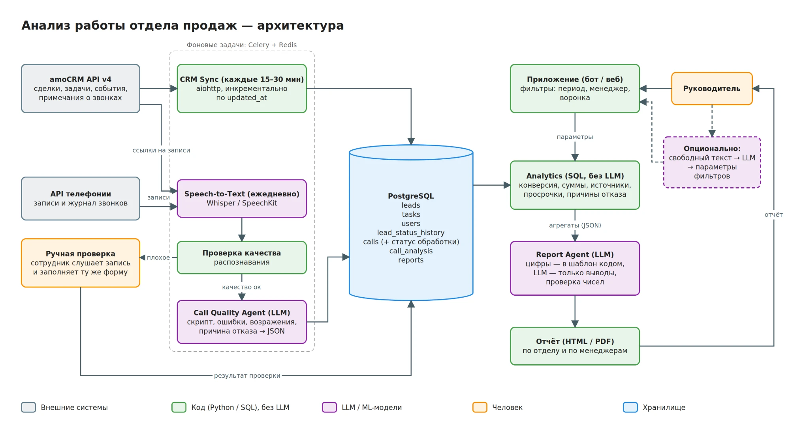

# Анализ работы отдела продаж — тестовое задание CityCar

> Руководитель пишет: **«Проанализируй работу отдела продаж за последние 30 дней»**.
> Источники данных: amoCRM (сделки, задачи) и телефония (записи звонков).

| Пункт | Где |
|---|---|
| 1. Архитектура | [ниже](#1-архитектура-решения) · [схема](docs/architecture.png) · [drawio](docs/architecture.drawio) |
| 2. Что делает система, а что человек; риски | [ниже](#2-что-система-делает-сама-а-что-передаёт-человеку) |
| 3. Код: сделки без задач / с просроченными задачами | [ниже](#3-код-сделки-без-задач-или-с-просроченными-задачами) · [`task3/problem_leads.py`](task3/problem_leads.py) |
| 4. Реальный AI-проект: English-Bot | [ниже](#4-реальный-ai-проект-english-bot) |
| 5. Чему научился за последние полгода | [ниже](#5-чему-я-научился-самостоятельно-за-последние-полгода) |
| 6. Улучшение, доведённое до результата | [ниже](#6-улучшение-которое-я-предложил-и-довёл-до-результата) |

---

## 1. Архитектура решения

**Принцип:** всё, что можно посчитать точно, считает код (Python + SQL). LLM используется только там, где нужно
понимать смысл: анализ разговоров и текстовые выводы. Поэтому цифры в отчёте не могут быть «придуманы» моделью.



### Компоненты

**1. CRM Sync** — *код, без LLM*
- Фоновая задача Celery каждые 15–30 минут забирает из **amoCRM API v4** (aiohttp) сделки, задачи, пользователей,
  этапы воронок и историю смены этапов (`/api/v4/events`).
- Загрузка инкрементальная по `updated_at`, с учётом пагинации и лимита запросов. Удаления сделок и задач
  отслеживаются через события (`lead_deleted`) или вебхуки.
- Данные хранятся в собственной PostgreSQL. Это даёт историю, которая не пропадёт при удалении задачи или сделки в CRM,
  аналитику на SQL без упора в лимиты API и быстрые отчёты.

**2. Call Quality Agent** — *LLM*
- Ежедневная задача Celery берёт новые звонки.
- **Привязка к сделке** идёт через примечания `call_in` / `call_out` в amoCRM (в них есть ссылка на запись). Звонки,
  которых нет в CRM, подтягиваются из API телефонии и сопоставляются по номеру телефона.
- **Speech-to-Text:** Whisper / SpeechKit.
- **Проверка качества распознавания:** уверенность STT-модели, доля пустых участков, соответствие длины текста длительности звонка.
  - качество низкое → звонок попадает в **очередь на ручную проверку**. Сотрудник прослушивает запись и заполняет *ту же форму*,
    что и LLM, поэтому его результаты учитываются в статистике наравне с автоматическими;
  - качество нормальное → LLM возвращает **структурированный JSON**: соблюдение скрипта, ошибки менеджера, возражения
    клиента, причина отказа из фиксированного списка категорий, краткое резюме.
- Повторно звонок не обрабатывается. Идемпотентность обеспечивается по `call_id` и статусу в таблице `calls`.

**3. Analytics** — *SQL, без LLM*

Метрики за выбранный период считаются по отделу целиком и по каждому менеджеру:
выиграно / проиграно / в работе · конверсия (доля успешных среди закрытых) · сумма успешных сделок ·
конверсия по источникам заявок · просроченные задачи и сделки в работе без следующей задачи ·
распределение причин отказа по CRM и по звонкам · средняя оценка звонков и частые ошибки.

**4. Report Agent** — *LLM*
- Получает готовые **агрегаты в JSON**, а не сырые данные.
- Цифры подставляются в шаблон отчёта кодом. LLM пишет только выводы по схеме
  **что происходит → почему → где проблема → что требует внимания**.
- Отдельно выделяются **расхождения**: причина отказа в CRM ≠ причина из разговора.
- Перед отправкой код проверяет, что числа в тексте совпадают с посчитанными.

**5. Точка входа**
- Руководитель выбирает параметры в приложении (Telegram-бот или веб): период, менеджер или весь отдел, воронка.
  Параметры передаются в расчёт **напрямую, без LLM**. Это бесплатно, мгновенно и исключает ошибку разбора.
- *Опционально:* свободный текстовый запрос («Проанализируй работу отдела продаж за последние 30 дней»). LLM только
  переводит его в те же параметры фильтров.

### Хранилище — PostgreSQL

| Таблица | Содержимое |
|---|---|
| `leads`, `tasks`, `users` | копия данных amoCRM |
| `lead_status_history` | смены этапов из `/api/v4/events` |
| `calls` | метаданные, ссылка на запись, транскрипт, статус `new → transcribed → analyzed / needs_review → reviewed` |
| `call_analysis` | результат анализа (JSONB) |
| `reports` | сформированные отчёты |

Аудио не храним, только ссылку на запись. Брокер для Celery — Redis.

### Результат
Сводный отчёт по отделу (HTML / PDF или сообщение со ссылкой) с разделом по каждому менеджеру и ссылками на проблемные
сделки и звонки. Если часть звонков ещё не обработана, это прямо указывается в отчёте.

---

## 2. Что система делает сама, а что передаёт человеку

| Система делает сама | Передаёт человеку |
|---|---|
| Синхронизирует данные из amoCRM и телефонии | **Звонки с плохим качеством записи**: сотрудник прослушивает их и заполняет ту же форму анализа, что и LLM |
| Считает все метрики (код и SQL, без LLM) | **Выборочную проверку анализа ИИ**: например, 5% обработанных звонков, чтобы контролировать точность модели |
| Транскрибирует и анализирует звонки нормального качества | **Решения по итогам отчёта**: разговор с менеджером, изменение скрипта, перераспределение сделок. Система показывает проблему и аргументы, но сама не делает выводов о сотрудниках |
| Формирует отчёт с выводами и отправляет его руководителю | **Неоднозначные данные**: например, звонки, которые не удалось привязать к сделке, попадают в отдельный список |

> Система работает с amoCRM **только на чтение**: ничего не меняет в сделках и не ставит задачи менеджерам.

### Три главных риска

| # | Риск | Последствие | Как снижаем |
|---|---|---|---|
| 1 | **Ошибки ИИ в анализе разговоров** | Неточное распознавание речи или неверная интерпретация LLM дают неверную причину отказа или несправедливую оценку менеджера | Фиксированный список категорий вместо свободного текста · обязательная цитата из транскрипта как обоснование вывода · проверка качества записи перед анализом · выборочная ручная проверка |
| 2 | **Некорректные исходные данные и расчёты** | Менеджеры не заполняют поля, ставят причину отказа «Другое», звонки не привязаны к сделкам, а ошибка в SQL даст неверные цифры во всём отчёте | Тесты расчётов на эталонных данных · сверка ключевых цифр со встроенной аналитикой amoCRM · явная пометка в отчёте о неполных данных (сколько сделок без причины отказа, сколько звонков не обработано). Заодно система подсвечивает, какие менеджеры плохо ведут CRM |
| 3 | **Персональные данные (152-ФЗ)** | Передача записей и транскриптов во внешнюю LLM, особенно зарубежную, — юридический риск | Российские модели (YandexGPT, GigaChat) или модель, развёрнутая у себя · обезличивание транскриптов перед отправкой (телефоны, ФИО, адреса) · ограничение доступа к записям и отчётам |

---

## 3. Код: сделки без задач или с просроченными задачами

Сделка считается проблемной, если она в работе (статус не 142/143) и у неё нет открытых задач или хотя бы одна
открытая задача просрочена.

**Основная логика — [`task3/problem_leads.py`](task3/problem_leads.py) (32 строки).** Вспомогательный код вынесен в
отдельные модули, чтобы основная логика читалась сверху вниз:

| Файл | Что внутри |
|---|---|
| [`main.py`](main.py) | точка входа: открывает сессию, вызывает `find_problem_leads()`, печатает результат в JSON |
| [`task3/problem_leads.py`](task3/problem_leads.py) | `classify()` — чистая функция с правилом, `find_problem_leads()` — загрузка и классификация |
| [`task3/client.py`](task3/client.py) | `amo_session()` — открытие сессии; повторы при 429/5xx/сетевых ошибках (tenacity); пагинация `fetch_all()` |
| [`task3/schemas.py`](task3/schemas.py) | pydantic-схемы: `Lead`, `Task`, страница HAL `AmoPage[T]`, результат `ProblemLeads` |
| [`tests/test_task3.py`](tests/test_task3.py) | правило, разбор ответов, пагинация и 204 на локальном HTTP-сервере |

Весь ответ amoCRM, включая обёртку `_embedded` / `_links`, проверяется pydantic. Неожиданный формат превращается
в `AmoResponseError` с именем поля, а не в `KeyError` посреди кода.

```bash
uv sync
uv run pytest
```

Запуск (результат печатается в JSON). `AMO_SUBDOMAIN` — часть адреса до `.amocrm.ru`, `AMO_TOKEN` — долгосрочный токен интеграции.

```bash
# Linux / macOS / Git Bash
AMO_SUBDOMAIN=... AMO_TOKEN=... uv run python main.py
```
```powershell
# Windows PowerShell
$env:AMO_SUBDOMAIN = "..."; $env:AMO_TOKEN = "..."; uv run python main.py
```

---

## 4. Реальный AI-проект: English-Bot

**Задача.** AI-платформа для изучения английского (стартап, команда из 4 человек), я — backend-разработчик.
Нужно было генерировать для пользователей тесты и персональные рекомендации с помощью LLM: надёжно и без лишних
затрат на вызовы модели.

**Архитектура.** Backend на FastAPI по Clean Architecture (Repository, Unit of Work, DI через Protocols).
Генерация через Gemini вынесена в фоновые задачи Celery с машиной состояний: у каждой задачи понятный статус, а при
сбое срабатывает fallback, поэтому ни одна задача не остаётся «зависшей». С Telegram-сервисом backend общается через Kafka.

**Как AI получает данные.** Пользователь выбирает тему и уровень сложности, эти параметры передаются в промпт.
Результат генерации сохраняется в PostgreSQL.

**Что система делает сама.** Генерирует тесты и рекомендации, переиспользует уже сгенерированные тесты по популярным
темам и сама восстанавливается после сбоев LLM.

**Ограничения и как они решены**

| Ограничение | Решение | Эффект |
|---|---|---|
| Таймауты и лимиты LLM-провайдера | Двухуровневые ретраи: tenacity для таймаутов, backoff Celery для 429 и 5xx | Восстановление после единичного таймаута — 1–2 секунды вместо десятков |
| Стоимость вызовов | Переиспользование сгенерированных тестов | На 40–60% меньше запросов к LLM по популярным темам |

**Результат для бизнеса.** Расходы на LLM по популярным темам снизились на 40–60%, генерация стабильна и без
зависших задач: пользователь всегда получает тест или понятный статус, а не бесконечную загрузку.

**Стек:** Python, FastAPI, PostgreSQL, SQLAlchemy (async), Celery, Redis, Kafka, Gemini API, Docker.

---

## 5. Чему я научился самостоятельно за последние полгода

**Kafka.** Раньше для обмена событиями между сервисами я использовал Redis Pub/Sub. В English-Bot нужна была надёжная
доставка событий в Telegram-сервис, поэтому я сам изучил Kafka и внедрил её: события о необходимости пройти тест,
обработка переносов и повторные уведомления. Пришлось разобраться с consumer groups, ручным commit offset после
обработки (at-least-once, повторная доставка при сбое) и идемпотентной обработкой, чтобы повторное событие
не порождало дубль уведомления.

**Работа с LLM в продакшене.** Научился строить вокруг LLM надёжную обвязку: ретраи с разной стратегией для разных
ошибок, fallback, контроль статусов задач, сокращение числа вызовов за счёт кеширования результатов. Всё это работает
в English-Bot.

**Claude Code в разработке.** Активно использую его для написания кода, тестов и рефакторинга, но не принимаю
результат вслепую: архитектурные решения принимаю сам, проверяю каждый diff перед коммитом и прогоняю тесты.
Так скорость растёт, а качество кода остаётся под моим контролем.

---

## 6. Улучшение, которое я предложил и довёл до результата

**Проблема.** Пользователи регистрировались на сайте, решали тесты, но потом уставали, закрывали сайт и забывали
про него. Для изучения языка важна регулярность, а такие пользователи переставали заниматься.

**Что я предложил.** Регистрация шла через Telegram, поэтому я предложил возвращать пользователей через бота: присылать
напоминание продолжить обучение вместе с примерами тестов, которые можно решить прямо сейчас. Чтобы напоминания
не раздражали, пользователь может отложить их на 1–3 часа, и бот напомнит повторно в выбранное время.

**Как реализовал.** Спроектировал асинхронное взаимодействие backend и Telegram-сервиса через Kafka: события
о необходимости продолжить обучение, обработка переносов и повторные уведомления через планировщик отложенных
сообщений. Сервисы не зависят друг от друга напрямую: если бот временно недоступен, события не теряются.

**Результат.** По аналитике за 5 недель доля возвратов на сайт выросла **с 25% до 35%**.
